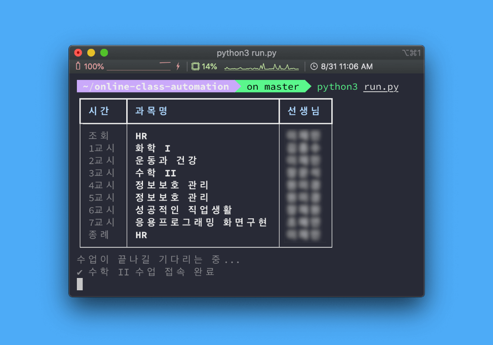

# Online Class Automation



> ♥️ Special thanks to [@uhmseohun](https://github.com/uhmseohun), [@Changemin](https://github.com/Changemin), [@HyeokjinKang](https://github.com/HyeokjinKang)

**코로나19로 인해 원격수업을 진행하게 됨에 따라, 각 수업시간에 맞춰 강의실에 자동으로 접속할 수 있도록 하는 스크립트입니다.**

> Due to COVID-19, all schools in South Korea are doing their classes online, which means **students has to find their own classrooms** before each class start.<br />
> Since I desperately want to sleep during it, but don't want to be disturbed each time when a class end, I came up this script, which **automates joining ZOOM meetings** for online classes at the right time.

# 🚀 Usage

```bash
git clone https://github.com/junhoyeo/online-class-automation
cd online-class-automation

# 파이썬 의존성 설치 후 스크립트 실행
pip3 install schedule rich
python3 run.py

# 오늘의 시간표를 출력한 뒤 다음 수업의 시작 시간을 기다립니다.
```

# 📌 Todo

- [ ] [교육청 자가진단](https://github.com/junhoyeo/self-check-automation) 기능 추가
- [ ] 수업이 끝날 시간이 되면 자동으로 이전 수업을 종료
